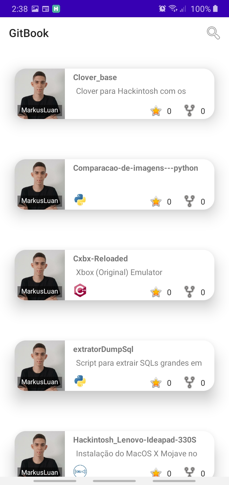
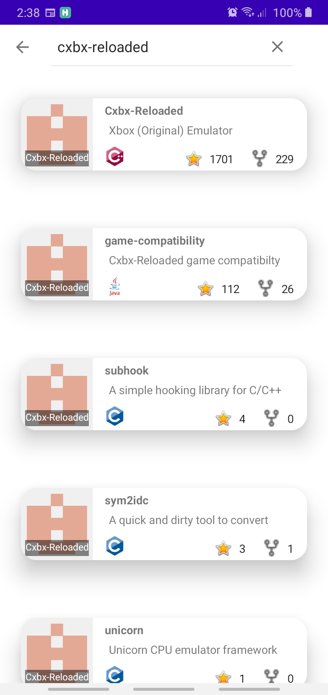

# Mobile-GitBook

Aplicativo desenvolvido para o Bootcamp Inter Android Developer oferecido pela Digital Inovation One

Crie um App Android para apresentar seu portfólio de projetos do GitHub de maneira elegante e simplificada. Nesse contexto, você passará por todo o processo de desenvolvimento usando o Kotlin, uma das linguagens de programação de maior ascensão nos últimos anos. Por fim, você é desafiado a entregar seu próprio projeto, incorporando suas próprias evoluções e melhorias! Está preparado?

Obs: Icones das linguagens de programações obtidos em [DevIcon](https://devicon.dev/)

 
